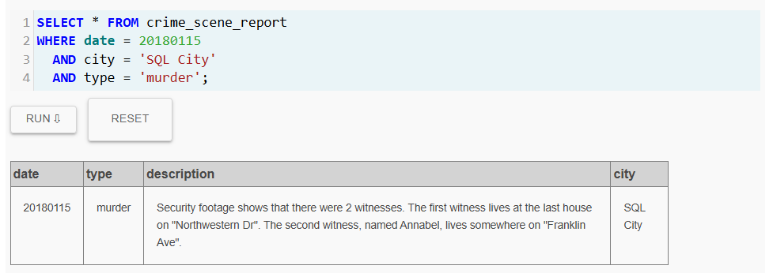
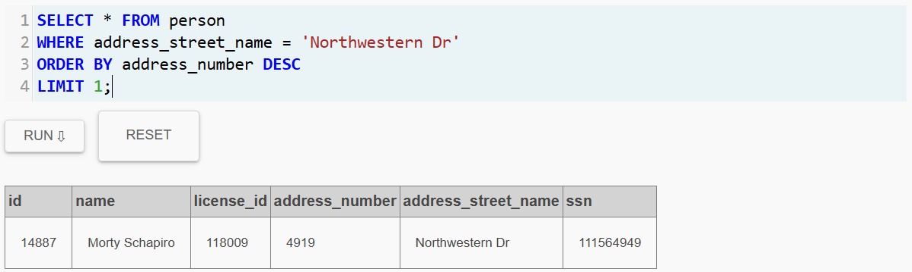
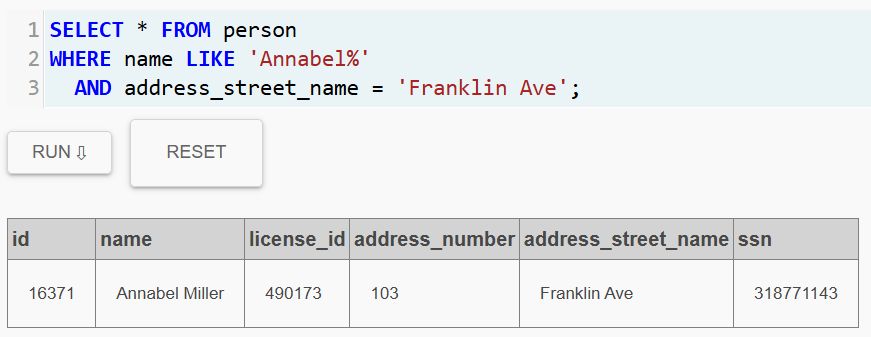
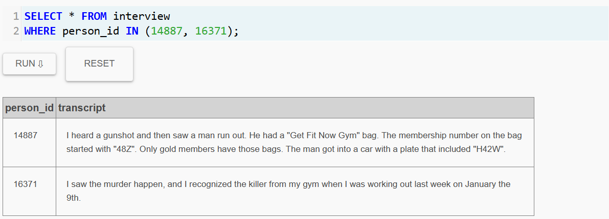
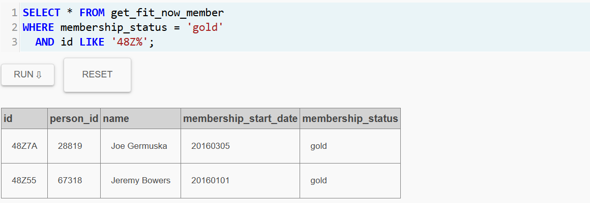
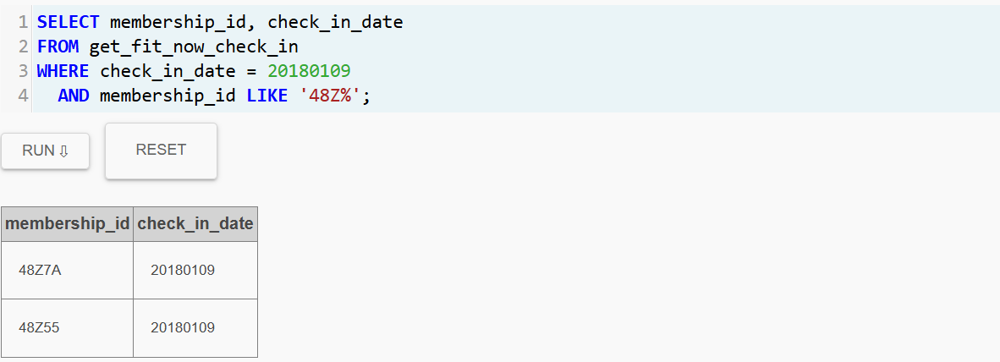
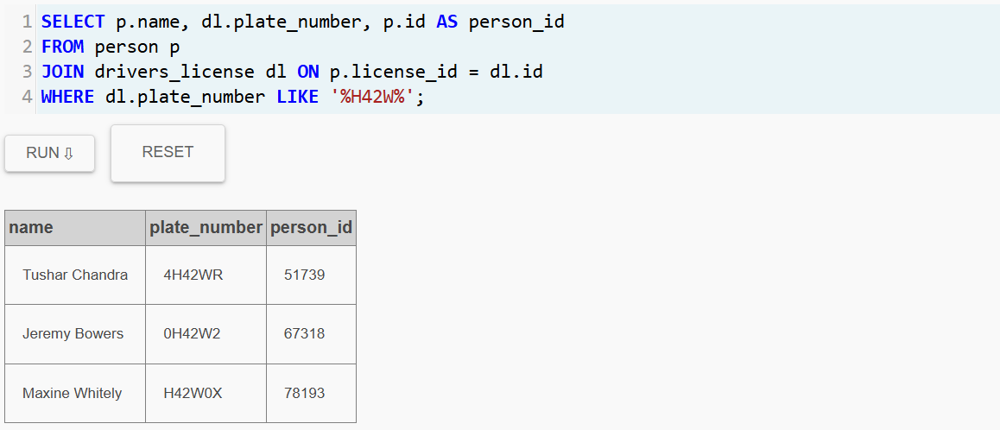

# Laboratorio II: SQL Murder Mystery

## Perfil de Investigador
* **Detective a cargo del caso:** Laura Camila Fernández Ospina
* **Identificación:** CC. 1036449298
* **Placa Policial:** 2026-1 SQL DEPT
* **Departamento:** Unidad Inteligencia de Datos en SQL City

## Resumen Inicial del Caso

> **Fecha del incidente:** 15 de enero de 2018  
> **Ubicación:** SQL City  
> **Tipo de crimen:** Asesinato

## Bitácora de Investigación

### Paso 1: Análisis de la Escena del Crimen
Se inició la investigación consultando el reporte de la policía de **SQL City** para el día del incidente. Esto nos revela la siguiente información:

> **Hallazgo:** El reporte indica que hubo dos testigos. El primero el cual nombre no se sabe, vive en la última casa de "Northwestern Dr" y la segunda se llama Annabel y vive en "Franklin Ave".

### Paso 2: Identificación de Testigos
Utilizando las pistas del reporte, procedí a buscar los nombres de las personas y los ID en la tabla `person`. Asi se pudo encontrar la siguiente información:

#### Testigo 1: Residente de Northwestern Dr
Para encontrar a esta persona, filtré por la calle y ordené los números de casa de forma descendente para hallar la última vivienda.

* **Nombre:** Morty Schapiro
* **ID:** 14887

#### Testigo 2: Annabel Miller
Realicé una búsqueda por nombre y calle para localizar a la segunda testigo.

* **Nombre:** Annabel Miller
* **ID:** 16371

### Paso 3: Interrogatorio de los Testigos
Consulté la tabla `interview` utilizando los IDs de Morty y Annabel para obtener sus declaraciones oficiales.

**Pistas recolectadas:**
* El sospechoso es miembro **Gold** del gimnasio "Get Fit Now".
* Su número de membresía comienza con **48Z**.
* El sospechoso huyó en un vehículo con placa que contiene **H42W**.
* Fue visto en el gimnasio el día **9 de enero de 2018**.

### Paso 4: Pistas del Gimnasio
Al buscar las personas que estan relacionadas o pertenecen al los miembros **Gold** del gimnasio, encontramos dos sospechosos:

**Sospechoso 1:**

* **Nombre:** Joe Germuska
* **ID:** 48Z7A

---

**Sospechoso 2:**

* **Nombre:** Jeremy Bowers	
* **ID:** 48Z55

### Paso 5: Asistencia al Gimnasio el dia del Crimen

Al verificar que contamos con dos sospechosos distintos, decidimos examinar la asistencia al gimnasio con esa membresía en la fecha del crimen; nos dimos cuenta de que las mismas dos personas mencionadas anteriormente habían estado allí ese día

> **Nota importante:** Para este paso, nos estancamos en dos sospechosos, pero hay que tener que tenemos en posesión una pista mas acerca del asesinato, en este caso, el asesino se fue en un auto que contiene lo siguiente en su placa *H42W*.

### Paso 6: Buscar Registros de Placas

Considerando que ya disponíamos de información de la placa, procedemos a investigar en la base de datos cuáles individuos contienen la misma secuencia en su placa. Esto nos presenta una lista con tres individuos distintos:

* Tushar Chandra
* Jeremy Bowers
* Maxine Whitely

> [!IMPORTANT]
> Con toda la información recolectada, podemos establecer una coincidencia entre la identificación y el individuo: *Jeremy Bowers* está en nuestra lista de sospechosos al ser un sujeto que asistió al gimnasio el día del asesinato, lo cual coincide con la bolsa que llevaba y ahora coincide que huyó en un vehiculo que contiene en su placa la otra pista del testigo.

